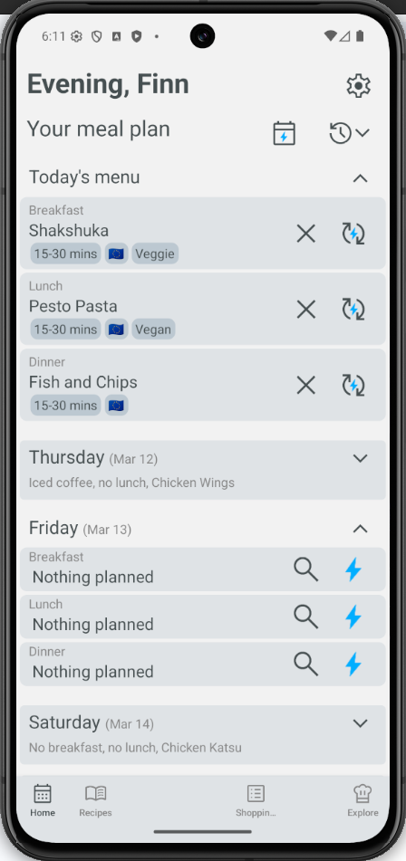
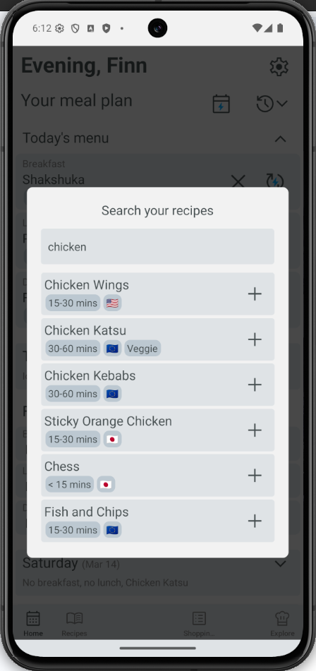
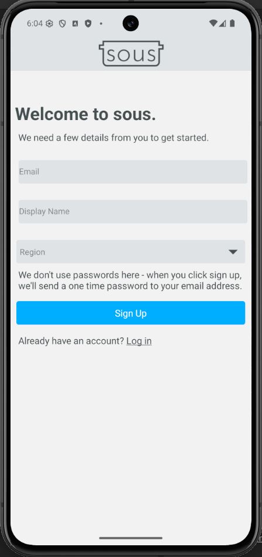

  <picture>
    <source media="(prefers-color-scheme: dark)" srcset="readme_assets/sous_transparent_dark.png">
    
    </picture>
  
Your personal meal planning assistant.

---

## 📖 About

*Sous* is a project inspired by the myriad of meal planning apps that seem very expensive for very basic functionality. This app is (at the moment) for personal use by myself and my girlfriend.

## ✨ Features

- **Meal Planning:** Easily plan your meals for the week ahead. Add recipes yourself, get suggestions for individual meals, or generate a plan for up to two weeks.
- **Recipe Management:** Add and organise your recipes.
- **Shopping Lists:** Automatically generate shopping lists based on your meal plan. Auto-categorise list items to make shopping easy.
- **Explore:** TikTok-style scrolling recipes to discover inspiration.
- **Cross-Platform:** Works on both Android and iOS.

## 📸 Screenshots

| Home | Recipes | Login |
| :---: | :---: | :---: |
|  |  |  |

## 🛠️ Technologies Used

- **Frontend:** [React Native](https://reactnative.dev/) with [Expo](https://expo.dev/)
- **Backend:** [Supabase](https://supabase.io/)
- **Navigation:** [React Navigation](https://reactnavigation.org/)
- **UI:** Custom components with a focus on a clean and minimal design.

