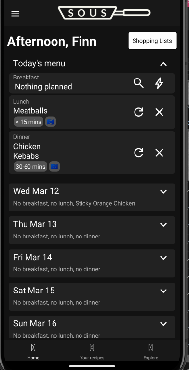

*sous* (intentionally not capitalised) is a personal project and is primarily a learning exercise. The idea behind it is to take the effort out of meal planning. It is built using React Native and Supabase.

## Preview
### Home page

### Shopping list page

### Your recipes

## Contributing

As this is a learning exercise, contributions to this repository will not be accepted.

## Licence

There is no licence associated with this project.